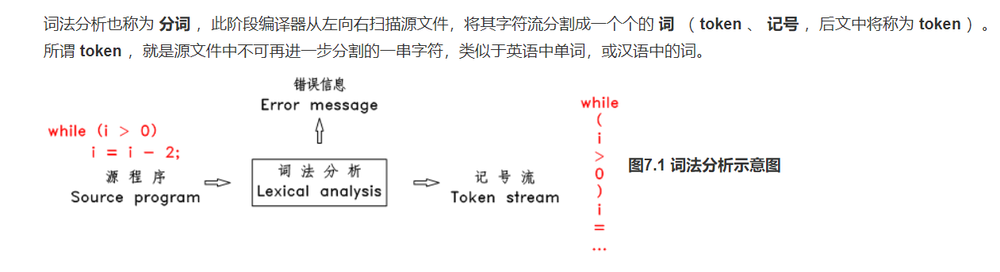

[参考链接]: https://www.bookset.io/read/pandolia-tinyc/52f5beb7f3f4db9d.md


# 1.FLEX的词法分析



程序语言所用的token也有限制，一般有常数，操作符，分隔符，保留字，标识符；

在flex中，**%%** 和 **%%** 之间的内容被称为 **规则（rules）**，本文件中每一行都是一条规则，每条规则由 **匹配模式（pattern）** 和 **事件（action）** 组成， 模式在前面，用正则表达式表示，事件在后面，即 C 代码。每当一个模式被匹配到时，后面的 C 代码被执行。

简单来说，flex 会将本段内容翻译成一个名为 **yylex** 的函数，该函数的作用就是扫描输入文件（默认情况下为标准输入），当扫描到一个完整的、最长的、可以和某条规则的正则表达式所匹配的字符串时，该函数会执行此规则后面的 C 代码。如果这些 C 代码中没有 **return** 语句，则执行完这些 C 代码后， **yylex** 函数会继续运行，开始下一轮的扫描和匹配。

当有多条规则的模式被匹配到时， **yylex** 会选择匹配长度最长的那条规则，如果有匹配长度相等的规则，则选择排在最前面的规则。

第二段中的 main 函数是程序的入口， flex 会将这些代码原样的复制到 **lex.yy.c** 文件的最后面。最后一行的 yywrap 函数的作用后面再讲，总之就是 flex 要求有这么一个函数。

# 2.utils.py

```python
def out():
    with open(YourLanuage) as f:
        text=f.read()
    # print("读取源代码完毕:"+str(text))
    p =Popen(LexEXE,shell=True,stdin=PIPE,stdout=PIPE)
    p.stdin.write(text.encode("GBK"))
    p.stdin.close()
    result=p.stdout.read().decode("GBK")
    # print(result)
    print("词法分析结束，路径："+OutputPath)
    return result;
def lex():
    #调用lex
    os.system(
        "flex "+LexPath
    )
    os.system(
        "move ./lex.yy.c ./out/lex.yy.c"
    )
    print("调用lex成功")
def gcc():
    try:
        os.system(
            "gcc ./out/lex.yy.c -fexec-charset=gbk -o " +LexEXE
        )
        print("调用gcc成功")
        return True
    except:
        return False
```

